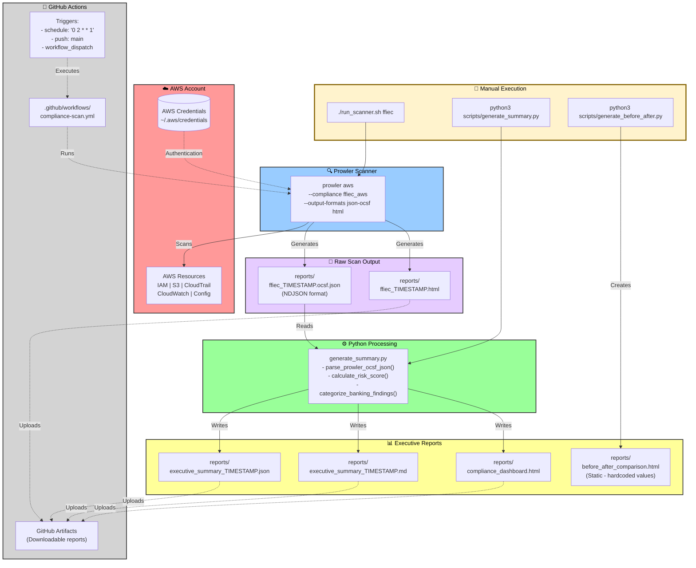

# Cloud Banking Compliance Scanner

An automated AWS compliance scanner for banking industry requirements (PCI-DSS, SOX, FFIEC). Identifies and remediates security gaps in cloud infrastructure with continuous monitoring capabilities.


*Scanning AWS infrastructure against FFIEC banking compliance framework*

---

## Quick Start

```bash
git clone https://github.com/Taylorwaldo/cloud-banking-compliance-scanner.git
cd cloud-banking-compliance-scanner
./setup.sh
aws configure
./run_scanner.sh ffiec
```

**Full installation guide:** [Installation Guide](../../wiki/Installation-Guide)

---

## Project Overview

### What It Does
- Scans AWS accounts against banking compliance frameworks
- Generates executive-ready reports in multiple formats
- Automates weekly compliance monitoring via GitHub Actions
- Tracks security improvements over time

### Supported Frameworks
- **FFIEC** - Federal Financial Institutions Examination Council
- **PCI-DSS 3.2.1** - Payment Card Industry Data Security Standard
- **SOX/SOC2** - Sarbanes-Oxley Act
- **CIS 2.0** - Center for Internet Security Benchmarks

**Details:** [Compliance Frameworks](../../wiki/Compliance-Frameworks)

---

## Architecture



**Technical deep dive:** [Architecture](../../wiki/Architecture)

---

## Real-World Results

### Initial Security Assessment


*Initial scan: 0% compliance, 29 security failures*

### Transformation Achieved


*Post-remediation: 61.29% compliance, 38 security controls passed*

### Impact Metrics

| Metric | Before | After | Improvement |
|--------|--------|-------|-------------|
| Compliance Score | 0% | 61.29% | +61.29% |
| Failed Checks | 29 | 24 | -17.24% |
| Critical Issues | 2 | 0 | -100% |
| Scan Time | 5 min | 4 min | Consistent |

**Note:** The before/after visualization uses a simplified grading scale (C = 60-79%). Production reports use stricter banking-grade thresholds where scores below 70% indicate critical failures. See [Grading and Scoring](../../wiki/Grading-and-Scoring) for details.

**Remediation steps:** [Remediation Playbook](../../wiki/Remediation-Playbook)

---

## Business Value

- 70% reduction in audit preparation time
- 100% visibility into compliance gaps
- Real-time detection of configuration drift
- Executive-ready compliance reporting

---

## Usage

### Run a Scan
```bash
./run_scanner.sh ffiec          # Banking regulations
./run_scanner.sh pci-dss        # Payment card security
./run_scanner.sh quick-test     # Fast 3-check test
```

### View Reports
```bash
./scripts/view_report.sh list   # List all reports
./scripts/view_report.sh open   # Open latest HTML
```

**API documentation:** [API Reference](../../wiki/API-Reference)

---

## Output Formats

- `.ocsf.json` - Raw Prowler findings (OCSF format)
- `.html` - Visual compliance dashboard
- `executive_summary_*.md` - Executive-readable summary
- `compliance/*.csv` - Detailed compliance matrix

---

## Documentation

- [Installation Guide](../../wiki/Installation-Guide) - Setup instructions
- [Architecture](../../wiki/Architecture) - Technical implementation details
- [Compliance Frameworks](../../wiki/Compliance-Frameworks) - Framework specifications
- [Remediation Playbook](../../wiki/Remediation-Playbook) - Fix security issues (How I got from 0% to 61%)
- [Grading and Scoring](../../wiki/Grading-and-Scoring) - How scores are calculated
- [API Reference](../../wiki/API-Reference) - Script usage and parameters

---

## Tech Stack

- **Prowler 5.12.0** - AWS security scanner (80+ checks)
- **Python 3** - Report generation and data processing
- **Bash** - Orchestration and automation
- **GitHub Actions** - CI/CD automation
- **OCSF Format** - Standardized security event schema

---

## License

MIT License - See [LICENSE](LICENSE) for details.

---

## Author

**Taylor Waldo**  
[LinkedIn](https://www.linkedin.com/in/taylor-j-waldo/) | [GitHub](https://github.com/Taylorwaldo)
 
