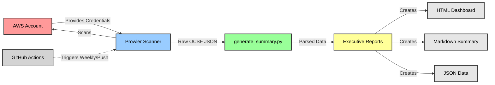

# Cloud Banking Compliance Scanner Project

## About
An automated AWS compliance scanner tailored for banking industry requirements (PCI-DSS, SOX, FFIEC), built to identify and remediate security gaps in cloud infrastructure. This tool demonstrates the critical importance of continuous compliance monitoring in financial services.


*Scanning AWS infrastructure against FFIEC banking compliance framework*

## Quick Start
```bash
# Clone the repository
git clone https://github.com/Taylorwaldo/cloud-banking-compliance-scanner.git
cd cloud-banking-compliance-scanner

# Run setup
./setup.sh

# Configure AWS credentials
aws configure

# Run compliance scan
./run_scanner.sh ffiec
```
## Project Architecture

### Workflow Overview



## Core Components

**run_scanner.sh:** Entry point wrapper script

**banking_compliance_scanner.sh:** Main orchestrator that coordinates Prowler and analysis

**generate_summary.py:** Processes raw scan data into executive summaries

**generate_before_after.py:** Creates transformation visualizations

## Compliance Frameworks
**This scanner evaluates AWS environments against:**

**FFIEC** - Federal Financial Institutions Examination Council

**PCI-DSS 3.2.1** - Payment Card Industry Data Security Standard

**SOX** - Sarbanes-Oxley Act (SOC2)

**CIS 2.0** - Center for Internet Security Benchmarks 

## Technical Components
Prowler Integration

**Version:** 5.12.0

**Role:** Core scanning engine executing 80+ security checks

**Output:** OCSF JSON, HTML reports, CSV compliance matrices

## AWS Test Environment

**Account Type:** AWS Free Tier

**Purpose:** Safe sandbox for compliance testing

**Services Scanned:** IAM, S3, CloudTrail, Config, CloudWatch

## Real-World Results
**Initial Security Assessment**

*Initial scan: 0% compliance, 29 security failures detected*

## Remediation Process
**The scanner identified critical gaps that were resolved through:**

**Enable CloudTrail** - Audit logging across all regions

**Configure Root MFA** - Critical access protection

**Activate AWS Config** - Continuous compliance monitoring

## Transformation Achieved


*Post-remediation: 61.29% compliance, 38 security controls passed*


## Impact Metrics

| **Metric**        | **Before** | **After** | **Improvement** |
|--------------------|------------|-----------|-----------------|
| Compliance Score   | 0%         | 61.29%    | +61.29%         |
| Failed Checks      | 29         | 24        | -17.24%         |
| Critical Issues    | 2          | 0         | -100%           |
| Scan Time          | 5 min      | 4 min     | Consistent      |

## Comparision (Before and after hardening)


> **Note on Grading:** The before/after visualization uses a simplified grading scale (C = 60-79%) for demonstration purposes. Production compliance reports generated by `generate_summary.py` apply stricter banking-grade thresholds where scores below 70% indicate critical failures requiring immediate remediation. See [Grading and Scoring](wiki/grading) for technical details.


## Business Value

- 70% reduction in audit preparation time
- 100% visibility into compliance gaps
- Real-time detection of configuration drift
- Executive-ready compliance reporting

## Output Formats
**After each scan, the tool generates:**

*.ocsf.json - Raw Prowler findings in OCSF format

*.html - Visual compliance dashboard

executive_summary_*.md - C-suite readable summary

compliance/*.csv - Detailed compliance matrix

## Installation
See Setup Guide for detailed instructions.

## Documentation

Architecture Details

Compliance Frameworks

Remediation Playbook

API Reference

## License
MIT License - See LICENSE for details.

## Author
Taylor Waldo

LinkedIn: [linkedin.com/in/taylorwaldo](https://www.linkedin.com/in/taylor-j-waldo/)

GitHub: @Taylorwaldo

 
